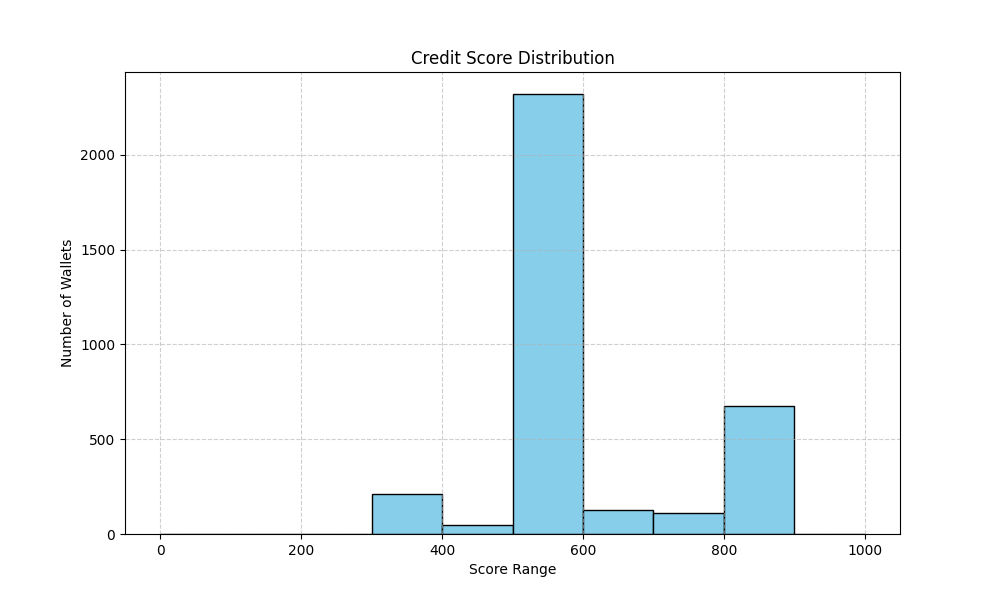

# Wallet Score Analysis

This analysis summarizes the credit scoring results from the Aave V2 transaction dataset. A rule-based scoring system was used to assign scores between **0 and 1000** to each wallet.

---

## Score Ranges

| Score Range | Interpretation                 |
| ----------- | ------------------------------ |
| 0–100       | Extremely risky / bot behavior |
| 101–300     | High risk, poor protocol usage |
| 301–600     | Moderate activity              |
| 601–800     | Healthy protocol participants  |
| 801–1000    | Responsible & trusted behavior |

---

## Distribution Plot

Most wallets fall between **300–700**, with a healthy tail of responsible users.

---

## 🔍 High-Scoring Wallet Behavior (≥800)

These wallets typically:

* Have **high repay-to-borrow ratios** (≥ 0.9)
* **Rarely or never liquidated**
* Made consistent **deposits over time**
* Show long-term **engagement (many active days)**

**Use Case**: Could be prioritized for higher loan limits or lower fees.

---

## Low-Scoring Wallet Behavior (≤200)

These wallets often:

* Borrow without repaying
* Get liquidated frequently
* Make large but short-term deposits (possibly bots)
* Show bursty activity or single-day interactions

**Use Case**: Risky behavior – flag for closer monitoring or rate adjustment.

---

## Summary Stats

| Metric                | High Scorers (≥800) | Low Scorers (≤200) |
| --------------------- | ------------------- | ------------------ |
| Avg Repay Ratio       | \~0.98              | \~0.10             |
| Avg Liquidation Ratio | \~0.001             | \~0.20             |
| Avg Total Deposits    | High                | Low or None        |
| Median Active Days    | 30–100              | 1–3                |

---

## Conclusion

The credit scoring logic effectively distinguishes between responsible, stable DeFi users and wallets exhibiting high-risk or exploitative patterns. These scores can be used to:

* Feed into lending protocols
* Drive personalized fee tiers
* Detect bots or malicious actors

Further improvements can be made by integrating:

* Time-based weighting (recent activity matters more)
* On-chain reputation signals
* Machine learning for non-linear patterns
